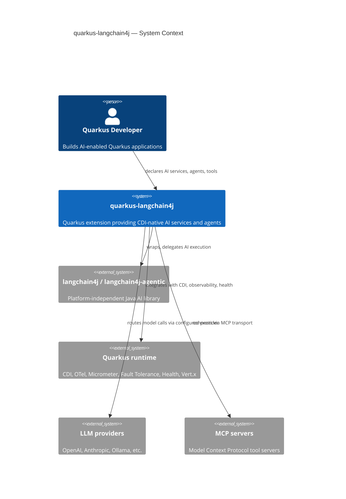
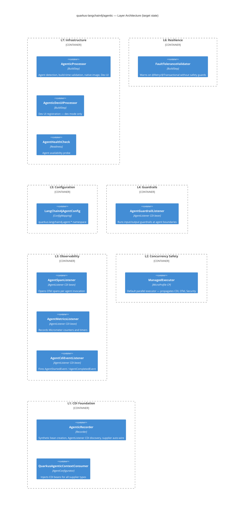
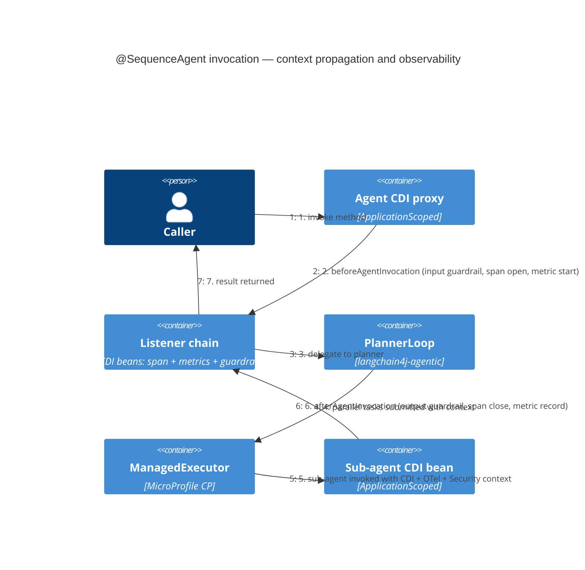

# ARC42STORIES — quarkus-langchain4j

**Profile:** Quarkus Extension  
**Version:** 0.1 (in progress)  
**Follows:** [Arc42Stories Specification](https://github.com/hortora/arc42stories-spec)

---

## §1 Introduction and Goals

**What this is:** A Quarkus extension that integrates the langchain4j AI library ecosystem into Quarkus applications, providing CDI-native AI services, agent orchestration, RAG, MCP, and model provider integrations.

**Upstream dependency model:** `quarkus-langchain4j` wraps `langchain4j` and `langchain4j-agentic`. Both are platform-independent Java libraries. This project is responsible for all Quarkus-specific wiring — CDI, OTel, Micrometer, Health, Fault Tolerance, Dev UI, native image. Upstream accepts no Quarkus-specific code.

**LangChain4j sync:** Manual, per upstream minor release. Dependabot excludes `dev.langchain4j:*` by policy.

### Artifact Schema

| Artifact type | Format | Example | Where it lives |
|---|---|---|---|
| Audit finding | `[A\|C\|S\|O\|L\|F\|D\|G]-N` | `A-2`, `C-1` | `AGENTIC-NATIVE-AUDIT.md` |
| Chapter | `CN` | `C1`, `C5` | §9.2 below |
| Layer | `LN` | `L1`, `L4` | §9.4 below |
| Design spec | `YYYY-MM-DD-topic` | `2026-06-03-agentic-cdi` | `docs/specs/` |
| ADR | `ADR-NNNN` | `ADR-0001` | `docs/adr/` |

---

## §2 Constraints

| Constraint | Source | Impact |
|---|---|---|
| No Quarkus code in upstream | `langchain4j-agentic` policy | All Quarkus wiring stays in this repo; framework-agnostic improvements go upstream as separate PRs |
| `langchain4j-agentic` is beta | Upstream versioning (`1.15.1-beta25`) | API changes with each beta; tight coupling accepted, tracked manually |
| `langchain4j` sync is manual | `dependabot.yml` policy | Each upstream minor release requires a dedicated upgrade commit |
| Quarkus minimum version pinned | `dependabot.yml` (`ignore: io.quarkus:*`) | Extension targets a minimum working Quarkus version, not always latest |

---

## §3 Context and Scope

**Scope of active work:** The `agentic/` module — identified via audit (`AGENTIC-NATIVE-AUDIT.md`) as having 42 gaps in Quarkus integration. Other modules (`core`, `mcp`, `rag`, `chat-scopes`) are well-integrated; `skills`, `embedding-stores` (cloud stores), `quarkus-integrations` have shallower integration but are not the current focus.

---

## §4 Solution Strategy

**Before:** The `agentic` module registers agents as CDI beans and delegates execution faithfully to `langchain4j-agentic`. The next integration layer — CDI injection in agent configuration, context propagation in parallel execution, OTel spans at the agent boundary, guardrail support, and a config namespace — is what this work delivers.

**After:** The `agentic` module becomes a first-class Quarkus integration: CDI injection replaces static suppliers, parallel execution propagates context via `ManagedExecutor`, agents appear in OTel traces and Micrometer metrics, guardrails apply to agent boundaries using the same API as AI services, and all parameters are tunable via `application.properties`.

**Approach:** Enhance the existing `agentic` module in-place. No new module name, no migration for users. Same `langchain4j-agentic` annotations (`@SequenceAgent`, `@ParallelAgent`, etc.) as the user-facing API. Track upstream beta releases manually.

**Upstream contributions (parallel track):** Framework-agnostic improvements (supplier SPI, threading contract, scope checkpoint) filed as upstream PRs to `langchain4j-agentic`. These are framed as platform-independent improvements, not Quarkus-specific requests.

### Chapter sequencing rationale

- C1 before all: establishes safe baseline; security fix (D-2) must ship before any feature work
- C2 before C4, C5: `AgentListener` CDI auto-discovery (L1) is required by OTel listener (L3) and guardrail listener (L4)
- C3 before C4: context propagation (L2) required before OTel spans are meaningful on worker threads
- C2 and C3 independent: can be developed in parallel, merged in either order
- C6 independent: configuration namespace touches no other layer
- C7 blocked on upstream: scope checkpoint requires upstream `langchain4j-agentic` API change
- C8 independent after C2: persistence sub-modules only need `AgentListener` CDI discovery to land

---

## §5 Building Block View

---

## §6 Runtime View

### Agent invocation with Quarkus context (target state)

---

## §7 Deployment View

Standard Quarkus deployment — JVM or GraalVM native. No agentic-specific infrastructure required for C1–C6. C8 (Persistent Agents) adds optional Infinispan or Redis dependency for `AgenticScopeStore`.

---

## §8 Crosscutting Concepts

| Concern | Governing reference |
|---|---|
| CDI synthetic bean registration pattern | `core/AgentServicesProcessor` — existing pattern to follow |
| AgentListener as CDI integration point | `AgentListener` SPI (`dev.langchain4j.agentic.observability`) |
| GuardrailsSupport wiring pattern | `core/runtime/GuardrailsSupport.java` |
| OTel span naming conventions | MCP module — `TracingMcpClientListener` |
| Micrometer metric naming | `core/runtime/listeners/MetricsChatModelListener.java` |
| Build-time validation pattern | `AgenticProcessor.validate()` — existing pattern |
| ConfigMapping pattern | Any provider `*Config.java` under `model-providers/` |

### Anti-patterns

**Symptom:** `@RequestScoped` bean in a tool throws `ContextNotActiveException` inside `@ParallelAgent`.  
**Cause:** Default parallel executor (`DefaultExecutorProvider`) is a raw `newVirtualThreadPerTaskExecutor` with no CDI context propagation.  
**Fix:** Land C3 (ManagedExecutor). Until then, users must supply an explicit `@ParallelExecutor` method returning a context-propagating executor.

**Symptom:** Dev UI `invokeAgent` accepts any class name from the browser.  
**Cause:** `AgenticJsonRpcService.invokeAgent` does `Class.forName(agentClassName)` without validating against known agents.  
**Fix:** C1 adds allow-list check against build-time agent class names. Do not ship any feature work until C1 lands.

**Symptom:** `@Retry` on a `@SequenceAgent` produces stale partial results on retry.  
**Cause:** `AgenticScope` is not checkpointed before each attempt; retry re-enters a scope that already contains output from the first (failed) attempt.  
**Fix:** C7 (requires upstream scope checkpoint API). Until then: build-time warning when `@Retry` is detected on an agent method.

---

## §9 Journeys and Chapters

### §9.1 Journey Overview

| Journey | Description | Chapters | Status |
|---|---|---|---|
| J1: Quarkus-Native Agentic | Make the `agentic` module a first-class Quarkus integration | C1–C8 | 🚧 In progress |
| J2: Upstream Contributions | Contribute framework-agnostic improvements to `langchain4j-agentic` | parallel track | 🔲 Pending |

---

### §9.2 Chapter Index

| # | Chapter | Layers | Delta summary | Status | Audit refs |
|---|---|---|---|---|---|
| C1 | Quick Wins & Safety | L6, L7 | Low, Low | ✅ | D-1, D-2, F-3, F-4, F-5, F-7, C-6, C-7, S-3 |
| C2 | CDI-Native Agents | L1 | High | 🔄 | S-1, S-2, O-3, A-1 partial |
| C3 | Parallel Safety | L2 | High | 🔄 | C-1, C-2, C-3, C-4 |
| C4 | Observable Agents | L3, L7 | High, Med | 🔲 | O-1, O-2, O-4, O-5, D-4, O-6 |
| C5 | Guarded Agents | L4 | High | 🔲 | A-2, G-1 |
| C6 | Configurable Agents | L5 | Medium | 🔲 | L-1, L-2, L-3 |
| C7 | Resilient Agents | L6 | High | 🔲 | F-2, F-6 — upstream PRs required |
| C8 | Persistent Agents | L8 (new) | High | 🔲 | A-7, L-4 |

**Layer × Chapter matrix**

| Layer | C1 | C2 | C3 | C4 | C5 | C6 | C7 | C8 |
|---|---|---|---|---|---|---|---|---|
| L1 CDI Foundation | — | **High** | — | — | Low | — | — | Low |
| L2 Concurrency Safety | — | — | **High** | — | — | — | — | — |
| L3 Observability | — | — | — | **High** | — | — | — | — |
| L4 Guardrails | — | — | — | — | **High** | — | — | — |
| L5 Configuration | — | — | — | — | — | **Med** | — | — |
| L6 Resilience | Low | — | — | — | — | — | **High** | — |
| L7 Infrastructure | Low | — | — | Med | — | — | — | — |
| L8 Persistence | — | — | — | — | — | — | — | **High** |

**Sequencing rationale:**
- C1 before all: D-2 (security) must ship before any other feature work
- C2 before C4: `AgentListener` CDI discovery (L1) required by OTel/metrics listeners (L3)
- C2 before C5: guardrail listener (L4) is an `AgentListener` CDI bean
- C3 before C4: context propagation (L2) required before OTel spans are meaningful on worker threads
- C2 and C3 independent: can develop in parallel
- C6 independent: no layer dependencies
- C7 blocked: requires upstream `langchain4j-agentic` scope checkpoint API; file upstream PR at C1 close
- C8 after C2: persistence listener is an `AgentListener` CDI bean

---

### §9.3 Chapter Entries

---

#### Chapter 1 — Quick Wins & Safety

**Journey:** J1 | **Sequence:** 1 of 8 | **Status:** 🔲  
**Issues:** 🔲 | **Blog:** 🔲

**What this delivers**  
The Dev UI `invokeAgent` endpoint is protected against arbitrary class loading. Build-time warnings fire when `@Retry`, `@Transactional`, or `@Fallback(fallbackMethod=...)` are used unsafely on agent interfaces. Inherited interceptor bindings are detected correctly. Seven one-line fixes land as a single low-risk PR.

**Accountability gaps closed**
- Unauthenticated reflection → L7 (allow-list check against build-time agent class names)
- Silent `@Fallback` runtime failure → L6 (build-time `ValidationErrorBuildItem`)
- Silent `@Transactional` + scope divergence → L6 (build-time warning)

**Layer Impact**
| Layer | Delta |
|---|---|
| L6 Resilience | Low |
| L7 Infrastructure | Low |

---

#### Chapter 2 — CDI-Native Agents

**Journey:** J1 | **Sequence:** 2 of 8 | **Status:** 🔄 implemented, PR pending  
**Issues:** 🔲 | **Blog:** 🔲 | **Branch:** `c2-cdi-native-agents`

**What this delivers**  
Agent configuration no longer requires static supplier methods. `ContentRetriever`, `ChatMemory`, `ChatMemoryProvider`, and `RetrievalAugmentor` CDI beans are automatically wired into any agent that does not declare a static supplier for that type (build-time detection via `BeanDiscoveryFinishedBuildItem`, runtime wiring via `Instance<T>` injection points). `AgentListener` CDI beans are auto-discovered globally and compose additively with per-agent `@AgentListenerSupplier`. `@CdiBean` parameter resolver gains qualifier support (S-2). `@RequestScoped`/`@SessionScoped` beans rejected at build time.

**Accountability gaps closed**
- Static supplier pattern blocks CDI injection, scoping, and testability → L1

**Layer Impact**
| Layer | Delta |
|---|---|
| L1 CDI Foundation | High |

---

#### Chapter 3 — Parallel Safety

**Journey:** J1 | **Sequence:** 3 of 8 | **Status:** 🔄 implemented, PR pending  
**Issues:** 🔲 | **Blog:** 🔲 | **Branch:** `c3-parallel-safety`

**What this delivers**  
`@ParallelAgent` execution propagates CDI context, OTel spans, and `SecurityIdentity` to sub-agent worker threads. A Quarkus `ManagedExecutor` replaces `DefaultExecutorProvider`'s raw virtual-thread executor as the default. `@RequestScoped` beans used in agent tools no longer throw `ContextNotActiveException` in parallel scenarios.

**Accountability gaps closed**
- CDI context loss in parallel execution → L2
- OTel/Security context loss on worker threads → L2

**Layer Impact**
| Layer | Delta |
|---|---|
| L2 Concurrency Safety | High |

---

#### Chapter 4 — Observable Agents

**Journey:** J1 | **Sequence:** 4 of 8 | **Status:** 🔲  
**Depends on:** C2, C3 | **Issues:** 🔲 | **Blog:** 🔲

**What this delivers**  
Every agent invocation appears as a named OTel span, nested correctly under its parent. Micrometer counters and timers exist for agent invocations, errors, duration, and tool executions. A `@Readiness` health check reports agent availability. CDI events fire at agent lifecycle boundaries. Dev UI uses structured JSON instead of opaque HTML.

**Upstream context**  
Upstream `langchain4j-agentic` provides the `AgentListener` SPI and `AgentMonitor` (in-memory execution tree + HTML report generator) but zero production observability implementations — no OTel spans, no metrics, no health checks, no event bridge. This chapter is purely a Quarkus integration layer: CDI `AgentListener` beans that plug into the upstream SPI with Quarkus-native observability. Tool execution spans are deliberately excluded — the core module's `ToolSpanWrapper` already creates `langchain4j.tools.*` spans at the AI service level, and these nest correctly under agent spans via OTel context propagation (C3's `ManagedExecutor` wiring).

**Accountability gaps closed**
- No distributed trace visibility at agent boundaries → L3
- No alertable metrics for agent failure rate or latency → L3
- No readiness signal when agents fail to initialize → L7

**Layer Impact**
| Layer | Delta |
|---|---|
| L3 Observability | High |
| L7 Infrastructure | Medium |

---

#### Chapter 5 — Guarded Agents

**Journey:** J1 | **Sequence:** 5 of 8 | **Status:** 🔲  
**Depends on:** C2 | **Issues:** 🔲 | **Blog:** 🔲

**What this delivers**  
`@InputGuardrails` and `@OutputGuardrails` annotations are detected on agent interface methods at build time and wired via the `AgentListener` pipeline. Agent inputs can be validated or rewritten before the LLM call; agent outputs can be validated or trigger reprompting — using the same guardrail CDI bean API that AI services already support.

**Accountability gaps closed**
- No input/output safety validation at agent boundaries → L4
- Prompt injection and PII leakage undetectable at agent level → L4

**Layer Impact**
| Layer | Delta |
|---|---|
| L4 Guardrails | High |

---

#### Chapter 6 — Configurable Agents

**Journey:** J1 | **Sequence:** 6 of 8 | **Status:** 🔲  
**Issues:** 🔲 | **Blog:** 🔲

**What this delivers**  
A `quarkus.langchain4j.agent.*` config namespace exists. `A2AClientAgent` server URLs are resolvable via `application.properties` (no recompile to change environments). `maxIterations` and other agent parameters are overridable per-agent via config. The A2A transport uses Vert.x `WebClient` instead of raw JDK `HttpClient`.

**Accountability gaps closed**
- Agent URLs baked into annotations → L5
- No per-environment tuning without recompilation → L5
- A2A calls block Vert.x event loop → L2 (minor fix included here)

**Layer Impact**
| Layer | Delta |
|---|---|
| L5 Configuration | Medium |

---

#### Chapter 7 — Resilient Agents

**Journey:** J1 | **Sequence:** 7 of 8 | **Status:** 🔲  
**Depends on:** C1, upstream scope checkpoint PR | **Issues:** 🔲 | **Blog:** 🔲

**What this delivers**  
`@Retry` on stateful agents is safe: `AgenticScope` state is checkpointed before each attempt and restored on failure, preventing stale partial results. `@ErrorHandler` supports non-static methods, enabling CDI injection into error recovery logic.

**Accountability gaps closed**
- `@Retry` causes silent data corruption on stateful agents → L6
- `@ErrorHandler` cannot access CDI beans during recovery → L6

**Layer Impact**
| Layer | Delta |
|---|---|
| L6 Resilience | High |

---

#### Chapter 8 — Persistent Agents

**Journey:** J1 | **Sequence:** 8 of 8 | **Status:** 🔲  
**Depends on:** C2 | **Issues:** 🔲 | **Blog:** 🔲

**What this delivers**  
Agent scope state (`AgenticScope`) survives pod restarts and spans multiple nodes via pluggable `AgenticScopeStore` implementations. New sub-modules `quarkus-langchain4j-agentic-infinispan` and `quarkus-langchain4j-agentic-redis` provide store implementations. `AgenticProcessor` detects a CDI `AgenticScopeStore` bean at build time and wires it at runtime.

**Accountability gaps closed**
- PERSISTENT scope silently falls back to in-memory → L8
- Multi-node stateful agent workflows impossible → L8

**Layer Impact**
| Layer | Delta |
|---|---|
| L8 Persistence | High |

---

### §9.4 Layer Entries

---

### Layer — L1: CDI Foundation

**Participates in chapters:** C2, C5, C8  
**Architectural patterns:** Synthetic Bean, CDI auto-discovery, SPI extension  
**Key protocols:** 🔲  
**Completed:** 🔲

#### What it adds

**Before:** All agent configuration requires static methods on the agent interface (`@ChatModelSupplier`, `@ToolsSupplier`, etc.). CDI injection is impossible; the `@CdiBean` annotation is a narrow workaround for `@ChatModelSupplier` only.

**After:** `AgenticProcessor.cdiSupport()` detects CDI beans of the relevant types (`ContentRetriever`, `ChatMemory`, `ChatMemoryProvider`, `RetrievalAugmentor`) at build time via `BeanDiscoveryFinishedBuildItem` and adds `Instance<T>` injection points to agent synthetic beans. `QuarkusAgenticContextConsumer` wires them at runtime via `SyntheticCreationalContext.getInjectedReference()`. `AgentListener` CDI beans are discovered via an unconditional `Instance<AgentListener>` injection point on every agent — no `Arc.container()` calls in the auto-wiring path.

What this layer adds:
- **Supplier auto-wire** — for each supplier type without a static method, detects CDI bean at build time and injects via `SyntheticCreationalContext.getInjectedReference`; eliminates static method requirement for common types
- **AgentListener CDI discovery** — unconditional `Instance<AgentListener>` injection point on every agent; runtime iterates and calls `agentBuilder.listener()` for each; unblocks O-1, O-2, A-2, L8 listener wiring
- **Qualifier-aware `@CdiBean` resolution** — extracts qualifier annotations from parameters before `Arc.container().select(type, qualifiers)`; prevents `AmbiguousResolutionException` with named models

Not closed here: L2 (context propagation on worker threads), L4 (guardrail wiring).

#### Key files
🔲 at C2 close

#### Key wiring
🔲 at C2 close

#### Architectural decisions
🔲 at C2 close

#### Pattern introduced
CDI auto-wire for zero-static-method agent configuration.

#### Gotchas
🔲 at C2 close

#### Pattern to replicate
🔲 at C2 close

---

### Layer — L2: Concurrency Safety

**Participates in chapters:** C3  
**Architectural patterns:** MicroProfile Context Propagation, ManagedExecutor  
**Completed:** 🔲

#### What it adds

**Before:** `@ParallelAgent` uses `DefaultExecutorProvider.getDefaultExecutorService()` — a raw `newVirtualThreadPerTaskExecutor` with no CDI context, no OTel propagation, no security context.

**After:** A `ManagedExecutor` CDI bean is injected as the default parallel executor via `SyntheticCreationalContext`. The `LangChain4jManaged.CURRENT` `ThreadLocal` is propagated to worker threads via `ThreadContext.builder().propagated(ThreadContext.ALL_REMAINING).build()`.

What this layer adds:
- **ManagedExecutor default** — replaces `DefaultExecutorProvider` for all `@ParallelAgent` without explicit `@ParallelExecutor`; propagates CDI, OTel, and Security contexts to sub-threads
- **ThreadLocal propagation** — wraps submitted tasks to capture and restore `LangChain4jManaged.CURRENT` on worker threads; prevents silent `AgenticScope` isolation in parallel sub-agents

Not closed here: L3 (OTel spans at agent boundaries — needs L1 first), L6 (retry scope safety).

#### Key files
🔲 at C3 close

#### Gotchas
🔲 at C3 close

#### Pattern to replicate
🔲 at C3 close

---

### Layer — L3: Observability

**Participates in chapters:** C4  
**Architectural patterns:** CDI auto-discovered AgentListener, conditional capability registration  
**Key protocols:** MCP tracing conventions (`TracingMcpClientListener`) — follow span naming  
**Completed:** 🔲

#### What it adds

**Before:** No OTel spans at agent boundaries. No Micrometer metrics for agent invocations. No CDI events. `DevAgentMonitorHolder` static state accumulates stale entries across hot-reload.

**After:** Three CDI `AgentListener` beans auto-discovered via L1: `AgentSpanListener` (opens/closes OTel spans), `AgentMetricsListener` (records counters and timers), `AgentCdiEventListener` (fires `AgentStartedEvent`/`AgentCompletedEvent`). `@Readiness` health check reports agent availability. Dev UI returns structured JSON instead of HTML.

What this layer adds:
- **Agent OTel spans** — `AgentSpanListener` opens a span named `gen_ai.agent.invoke` in `beforeAgentInvocation`, closes in `afterAgentInvocation`; conditioned on `OpenTelemetrySdkBuildItem` capability
- **Agent Micrometer metrics** — `AgentMetricsListener` records `gen_ai.agent.invocations`, `gen_ai.agent.duration`, `gen_ai.agent.errors`, `gen_ai.agent.tool.executions`; conditioned on `MetricsCapabilityBuildItem`
- **CDI event bridge** — `AgentCdiEventListener` fires typed CDI events; enables user code to observe agent lifecycle without implementing `AgentListener`
- **Readiness probe** — `AgentHealthCheck` (@Readiness) resolves root agent CDI beans; reports DOWN if any fail

Not closed here: L4 (guardrails), L6 (retry safety).

#### Key files
🔲 at C4 close

#### Gotchas
🔲 at C4 close

#### Pattern to replicate
🔲 at C4 close

---

### Layer — L4: Guardrails

**Participates in chapters:** C5  
**Architectural patterns:** CDI auto-discovered AgentListener, build-time annotation detection  
**Key protocols:** `core/GuardrailsSupport` — follow existing guardrail wiring pattern  
**Completed:** 🔲

#### What it adds

**Before:** No input or output validation at agent boundaries. `@ErrorHandler` (static method) is the only failure hook — fires after failure, cannot modify inputs, cannot reprompt, cannot access CDI beans.

**After:** `AgenticProcessor` detects `@InputGuardrails`/`@OutputGuardrails` on agent interface methods at build time. An `AgentGuardrailListener` CDI bean runs the guardrail chain in `beforeAgentInvocation` (input) and `afterAgentInvocation` (output), using the same `GuardrailsSupport` infrastructure as AI services.

What this layer adds:
- **Build-time guardrail detection** — `AgenticProcessor @BuildStep` detects `@InputGuardrails`/`@OutputGuardrails` on agent methods; validates guardrail CDI bean types exist
- **AgentGuardrailListener** — CDI `AgentListener` bean that executes the guardrail chain; reuses `GuardrailsSupport` from `core/runtime`; injects guardrail CDI beans by type from detected annotations

Not closed here: L6 (retry scope safety — complementary resilience concern).

#### Key files
🔲 at C5 close

#### Gotchas
🔲 at C5 close

#### Pattern to replicate
🔲 at C5 close

---

### Layer — L5: Configuration

**Participates in chapters:** C6  
**Architectural patterns:** `@ConfigMapping`, runtime config resolution  
**Completed:** 🔲

#### What it adds

**Before:** No `quarkus.langchain4j.agent.*` config namespace. `A2AClientAgent.a2aServerUrl` is baked into the annotation at compile time. `maxIterations` requires recompilation to change.

**After:** `LangChain4jAgentConfig @ConfigMapping` introduces `quarkus.langchain4j.agent.*`. A2A URLs resolve config expressions at `RUNTIME_INIT`. Per-agent config overrides (maxIterations, timeout) applied via `AgentConfigurator`. A2A transport replaced with Vert.x `WebClient`.

What this layer adds:
- **Config namespace** — `@ConfigMapping(prefix = "quarkus.langchain4j.agent")` with `Map<String, AgentConfig> agents()` and A2A sub-config; resolves at `RUNTIME_INIT`
- **A2A URL externalisation** — annotation attribute supports `${my.url}` expression resolved at runtime; `quarkus.langchain4j.agent.a2a.<name>.url` takes precedence
- **Vert.x A2A transport** — `VertxA2AHttpClient` replacing `JdkA2AHttpClient`; non-blocking, TLS via `quarkus.tls.*`, OTel instrumented

Not closed here: L6, L8.

#### Key files
🔲 at C6 close

#### Gotchas
🔲 at C6 close

#### Pattern to replicate
🔲 at C6 close

---

### Layer — L6: Resilience

**Participates in chapters:** C1 (Low), C7 (High)  
**Architectural patterns:** Build-time validation, upstream scope checkpoint  
**Completed:** 🔲

#### What it adds (C1 portion)

**Before:** `@Fallback(fallbackMethod=...)` on agent interfaces fails silently at runtime. `@Retry` + `@Transactional` on agents can produce silent data divergence. Inherited interceptor bindings on base interfaces are missed.

**After (C1):** Build-time `ValidationErrorBuildItem` for `@Fallback(fallbackMethod=...)` on agent interfaces. Build-time warning for `@Retry` + `@Transactional` co-occurrence. `hasAnyInterceptorBindings` uses `annotations()` not `declaredAnnotations()`.

**After (C7 — pending upstream):** `AgenticScope` is checkpointed before each agent execution attempt and restored on failure. `@ErrorHandler` supports non-static methods with CDI injection.

#### Key files
🔲 at C7 close

#### Gotchas
🔲 at C7 close

#### Pattern to replicate
🔲 at C7 close

---

### Layer — L7: Infrastructure

**Participates in chapters:** C1 (Low), C4 (Medium)  
**Architectural patterns:** Build-time capability conditioning, Dev UI JSON-RPC  
**Completed:** 🔲

#### What it adds (C1 portion)

**Before:** `jsonRpcProvider` build step is not gated on `IsDevelopment.class` — registered in all profiles. `invokeAgent` accepts any class name from the browser without validating against known agent classes. `AgenticRecorder.loadClassSafe` uses the thread context classloader, which is not reliable on Vert.x worker threads.

**After (C1):** `jsonRpcProvider` gated on `IsDevelopment.class`. `invokeAgent` validates `agentClassName` against build-time allow-list. `loadClassSafe` uses `AgenticRecorder.class.getClassLoader()`.

**After (C4):** Dev UI returns structured JSON. `AgentHealthCheck @Readiness` wired. `DevAgentMonitorHolder` cleared via `ShutdownContext` on hot-reload.

#### Key files
🔲 at C4 close

#### Gotchas
🔲 at C4 close

#### Architectural decisions (C1)

**D-2 resolved (#2525):** Allow-list guard uses the `@RuntimeInit` recorder pattern
(matching `enableDevModeMonitoring`) to pass build-time agent class names to
`AgenticJsonRpcService`. A CDI bean would require the container to be available at
the point of enforcement — the recorder fires earlier and is the correct bridge for
write-once build-time data.

---

### Layer — L8: Persistence

**Participates in chapters:** C8  
**Architectural patterns:** CDI SPI bridge, optional sub-module  
**Completed:** 🔲

#### What it adds

**Before:** `AgenticScopeStore` SPI exists in `langchain4j-agentic` but has no Quarkus implementations. `PERSISTENT` scope kind silently falls back to in-memory. Multi-node stateful workflows are impossible.

**After:** `AgenticProcessor @BuildStep` detects a CDI `AgenticScopeStore` bean and wires it at `RUNTIME_INIT` via the recorder. Two new sub-modules (`quarkus-langchain4j-agentic-infinispan`, `quarkus-langchain4j-agentic-redis`) provide `@ApplicationScoped AgenticScopeStore` implementations. Mirrors the `ChatMemoryStore` sub-module pattern in `core`.

#### Key files
🔲 at C8 close

#### Gotchas
🔲 at C8 close

---

## §10 Architectural Decisions

### ADR-0001 — Enhance existing `agentic` module in-place rather than creating a new module

**Why in-place rather than a new `quarkus-agentic` module:** the enhanced module uses the same `langchain4j-agentic` annotations as the user-facing API; a second module with the same annotations would create classpath conflicts with no resolution mechanism. All Quarkus wiring is additive on top of the existing synthetic bean infrastructure.

**Tradeoff:** users of the current module get improved behaviour without migration, but existing behaviour that changes (e.g., default executor gaining context propagation) will do so silently. Mitigate with release notes and the C1 build-time warnings.

---

### ADR-0002 — `AgentListener` CDI auto-discovery as the primary extension point

**Why `AgentListener` rather than CDI interceptors:** interceptors apply to the CDI proxy boundary (the method call), not to the agent execution lifecycle (which includes planner iterations, sub-agent delegation, tool execution). `AgentListener` fires at the correct granularity for OTel spans, metrics, and guardrails. CDI interceptors remain valid for cross-cutting method-level concerns (e.g., `@RolesAllowed`, `@Timeout`).

**Tradeoff:** requires upstream `langchain4j-agentic` to maintain the `AgentListener` SPI as a stable extension point. If upstream removes or renames it, all L3/L4 wiring breaks. Monitor upstream beta releases.

---

## §11 Quality Requirements

| Quality goal | Measure | Target |
|---|---|---|
| Observability | All agent invocations visible as OTel spans | After C4 |
| Safety | No unauthenticated reflection in Dev UI | After C1 |
| CDI correctness | `@RequestScoped` beans usable in parallel agent tools | After C3 |
| Production readiness | Agent failure visible in health check | After C4 |
| Guardrail parity | Same guardrail API for agents as for AI services | After C5 |

---

## §12 Risks and Technical Debt

| Risk | Likelihood | Mitigation |
|---|---|---|
| `langchain4j-agentic` beta API breaks between releases | High | Manual upgrade process; `AgentListener` SPI is stable; recorder is the isolation boundary |
| Upstream rejects scope checkpoint PR (blocks C7) | Medium | Build-time warning ships in C1; C7 can be deferred indefinitely |
| C2 CDI auto-wire conflicts with existing static supplier methods | Low | "Static wins, CDI is fallback" precedence; build-time validation detects ambiguity |
| `ManagedExecutor` changes default threading behaviour (C3) | Low | Config opt-in initially (`quarkus.langchain4j.agent.use-managed-executor=true`) |

**Technical debt:**
- `PlannerAgentPromptTemplateContentFilterProvider` escape hack: fragile Mustache→Qute workaround maintained indefinitely until upstream switches to Qute-compatible syntax
- `A2AClientAgent` has no build-time discovery of remote agent contracts — purely runtime string-based
- `@CdiBean` annotation remains as escape hatch even after L1 auto-wire lands — two injection paths exist

---

## §13 Glossary

| Term | Definition |
|---|---|
| AgentListener | SPI interface in `dev.langchain4j.agentic.observability` with lifecycle callbacks fired at agent invocation boundaries |
| AgenticScope | State carrier for one agent invocation tree — not a CDI scope; a key-value store passed through the execution |
| AgenticScopeStore | SPI interface for persisting `AgenticScope` state across invocations or restarts |
| Chapter | A vertical cut through the architectural layers delivering one end-to-end capability — the delivery unit |
| Layer | A horizontal architectural concern — a technical tier or integration category — the implementation unit |
| Supplier annotation | Any of `@ChatModelSupplier`, `@ToolsSupplier`, `@ChatMemorySupplier` etc. — static method markers that the `langchain4j-agentic` library uses instead of DI |
| Synthetic bean | A CDI bean registered programmatically at build time via `SyntheticBeanBuildItem`, not discovered from source annotations |
